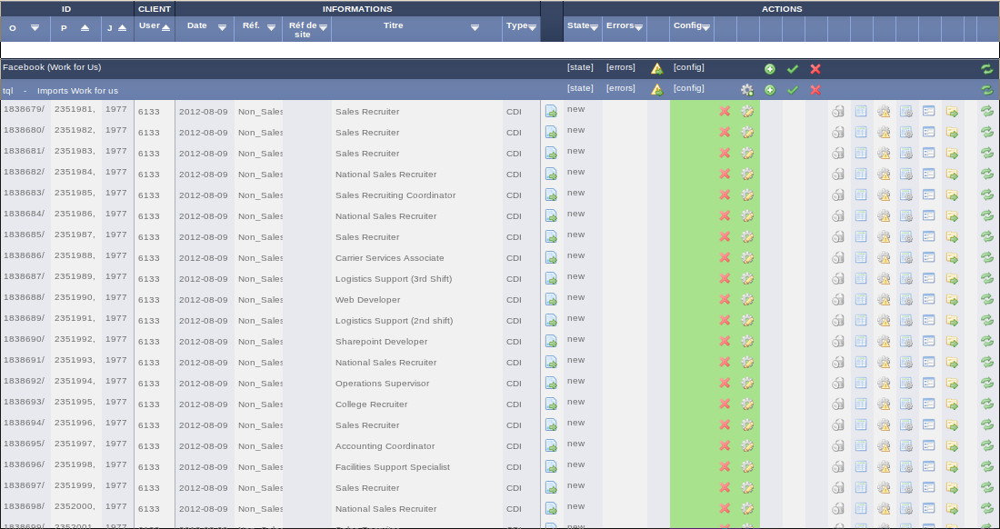

===============
Projet Job-Pipe
===============

Etude de l'existant
-------------------

Un système d'import a été développé il y a plusieurs années par Multiposting pour servir de support à ses activités. L'avantage de ce système est sa maturité ; il a été perfectionné et stabilisé pendant des années pour arriver à un résultat répondant au besoin de ses utilisateurs.

Ce système aura été une source d'inspiration (et sur certains aspects un exemple à ne pas suivre) tout au long du développement de job-pipe.

Un projet cross-entreprises
---------------------------

Les besoins pour un nouveau système plus performant se sont fait sentir depuis quelques mois. De ce constat, le projet job-pipe avait débuté chez Multiposting comme un projet à long terme qui serait développé en parallèle de leurs activités, mais job-pipe ne bénéficiait pas d'une équipe dédiée travaillant à plein temps à son développement.

Quelques temps plus tard, un accroissement du rythme des activités de Work4Labs a confirmé le besoin d'un système plus performant. Work4Labs a ainsi dédié des ressources au développement de Job Pipe. C'est à ce moment qu'à débuté mon stage. A cette époque le responsable du projet était Léopold Boudard. J'ai travaillé au début sous sa direction, puis, au bout de quelques semaines, il a été appelé à travailler sur d'autres projet (Work4Ads, la solution de publicité sur facebook de Work4Labs), et j'ai par la suite repris la direction du projet.

J'ai travaillé, avec les membres de l'équipe import sur Job-pipe pendant quelques mois pendant lesquels l'équipe était relativement autonome. Multiposting n'avait pas de ressource dédiée au projet, donc nous organisions régulièrement des réunions pour faire le point sur l'avancement du projet et s'assurer que le projet prenait une direction acceptable pour toutes les parties, mais nous décidions essentiellement seuls des décisions d'architecture, de conception, des fonctionnalités à implémenter prioritairement.

Quelques mois plus tard, Multiposting a alloué des développeurs à ce projet et le développement est maintenant supporté par une équipe chez Work4Labs (celle dont je fais partie) et une équipe chez Multiposting.

Développement d'une nouvelle solution
-------------------------------------

Le moment où le passage à un système d'import plus performant est devenu une obligation est la signature d'un contrat avec APEC, un des plus gros job-board français. APEC gère des dizaines de milliers d'offres d'emploi qu'il faut importer dans nos systèmes chaque jour. Le système d'import de Multiposting que nous utilisions au départ prenait deux jours complets à importer tous les jobs d'APEC. Deux jours pendant lesquels le système était monopolisé et était incapable de faire autre chose (comme importer les offres d'emploi des autres clients). De plus, la charge en mémoire était telle que le système dépassait les limites de ressource allouée à l'application, provoquant sont plantage. Il fallait donc relancer manuellement l'import plusieurs fois avant d'arriver au résultat voulu. Cette situation était inacceptable, et c'est l'une des raisons pour lesquelles Job-pipe est devenu incontournable.

Vue d'ensemble technique du projet
----------------------------------

Le rôle de Job-pipe est d'extraire les jobs de nombreuses sources différentes (page web, flux xml, ftp, webservice ...) pour ensuite appliquer sur chaque job un ensemble d'opérations qui vise à rendre les jobs exploitables par les différentes applications de Work4Labs. Ces opérations consistent essentiellement à mapper les catégories de job (Santé, Juridique, Bâtiment ...) à nos catégories internes, à adapter l'encodage des textes, à grouper ou diviser certains champs pour les faire correspondre à notre schéma de données ... Finalement Job-pipe va exporter tous les jobs qu'il aura importés puis transformés vers les différentes applications de Work4Labs qui vont ensuite exploiter ces jobs (les présenter sur Facebook, lancer des campagnes de publicité à leur propos, utiliser un moteur de recommandations pour trouver un job qui correspond à un candidat ou trouver un candidat qui correspond à un job).

Le principe essentiel qui a guidé la conception de job-pipe est que le système doit assumer une grosse charge d'entrée/sortie, et donc le système est conçu de manière asynchrone pour traiter les jobs pendant que le système est en attente après une entrée/sortie.

Par exemple, admettons que nous voulons extraire des jobs d'un site web. Job-pipe va envoyer une requête au site pour récupérer une liste des jobs. Pendant que Job-pipe attend que le site web réponde à sa requête, il va traiter les transformations (mapping, encodage, etc ...) des jobs qu'il aura déjà extraits. Ce modèle asynchrone permet d'optimiser les ressources en effectuant continuellement des calculs même pendant que le système attend la réponse d'entrée/sortie externe.

Technologies utilisées
----------------------

Job-pipe exploite plusieurs technologies pour arriver à ses fins.

Job-pipe est programmé essentiellement en Python_ (qui est un langage objet basé sur une machine virtuelle, au typage dynamique et dont la mémoire est gérée par un ramasse-miette).

La persistance est basée sur la base de données MongoDB_, une base de données NoSQL (utilisant un langage de requête qui lui est propre). La particularité de MongoDB est qu'il ne s'agit pas d'une base de données relationnelle. Cette base de données ne supporte pas les jointures par exemple. MongoDB est une base de données dite "Document", les tables sont remplacées par des collections, les lignes par des documents et chaque document peut être arbitrairement complexe (structure de données impriquées, liste de sous documents ...). De plus MongoDB ne possède pas de schéma fixe, c'est à dire que si un document possède un champ X, un autre document de la même collection peut ne pas posséder ce champ. Cela encourage un mode de programmation basé sur les conventions et l'introspection des objets quand cela est nécessaire.

La partie extraction des données a été construite avec l'aide du framework Scrapy_ lui même basé sur le framework Twisted_. Scrapy et Twisted nous permettent d'extraire des données de nombreuses sources simultanément en optimisant nos ressources.

Nous exploitons également le framework Django_ qui nous est utile pour toute la partie interface ainsi que pour l'intégration des nombreuses fonctionnalités fournies de base par Django (tests unitaires, parsing d'option de la ligne de commande, moteur de template ...)

Enfin nous utilisons beaucoup Celery_ qui nous permet d'une part de programmer facilement des tâches asynchrones et d'autre part nous permet de distribuer les calculs sur plusieurs serveurs. Celery se base sur une queue de messages (RabbitMQ dans notre cas) sur laquelle est centralisée la liste de toutes les tâches en attente d'exécution. Plusieurs Workers celery (potentiellement installés sur plusieurs serveurs) vont ensuite traiter les tâches contenues dans cette queue. Chaque worker peut traiter plusieurs tâches à la fois de manière asynchrone (quand une tâche est en attente d'entrée/sortie, le worker peut exécuter une autre tâche).

.. _Python: http://python.org
.. _MongoDB: http://mongodb.org
.. _Scrapy: http://scrapy.org
.. _Twisted: http://twistedmatrix.com
.. _Django: http://djangoproject.org
.. _Celery: http://celeryproject.org

Les débuts du projet Job-pipe
----------=------------------

Quand mon stage a débuté Job-pipe n'était pas utilisé en production. C'était plus une *proof of concept* qu'autre chose. Le premier objectif du projet a été d'obtenir un produit assez stable pour être utilisé en production et pour qu'on puisse lui faire confiance. Cela passe par une étape de détection de bugs et de correction de ceux ci, d'une manière générale, mais aussi de construire une couche de détection des erreurs qui surviennent. Ces erreurs doivent être détectées, stockées, et présentées aux personnes qu'elles concernent.
Cette étape a été atteinte quelques semaines après le début de mon stage. Nous avons ensuite pu nous concentrer sur l'ajout de nouvelles fonctionnalités.

Gestion de projet
-----------------

Chez Work4Labs les projets sont gérés de manière agile. Au début d'un projet, l'objectif est de produire un prototype minimaliste qui puisse être utilisé en production. Cela nous permet d'obtenir un feedback rapide, pour rectifier la direction dans laquelle va le projet si besoin est.

Nous fonctionnons itérativement. Un sprint dure une semaine, au début de laquelle l'équipe se réunit afin de faire le bilan du sprint précédent, de décider des rectifications à apporter au projet et pour planifier le sprint suivant. Le principe est de dégager quelques axes clés sur lesquels l'équipe va se concentrer pendant une semaine. A la fin de chaque sprint le projet est censé être dans un état utilisable en production. Nous préférons avoir une fonctionnalité très basique mais utilisable, que nous complèterons/refactoriserons plus tard plutôt qu'une fonctionnalité très complète et complexe, non terminée et qui prendra de nombreuses semaines à être implémentée.

Tous les jours en fin de journée, l'équipe se réunit pour faire un point de 15 minutes sur la journée qui vient de passer. Chaque développeur prend la parole tour à tour, pour expliquer ce qu'il a fait aujourd'hui, les difficultées qu'il a rencontrées, comment il les a résolues. C'est aussi l'occasion de demander des conseils aux autres développeurs en cas de doute. Ce point quotidien permet à l'équipe d'avoir une vision d'ensemble de ce qui se passe sur le projet et encourage le partage de connaissance, tout le monde est au courrant de tout ce qui se passe au niveau du projet, ce qui est un atout car tous les développeurs peuvent être amenés à travailler sur n'importe quel aspect de Job-pipe.

L'équipe est organisée autour de l'outil jira. C'est sur jira qu'est centralisée la liste des fonctionnalités à implémenter, des bugs à corriger, des tâches à effectuer ... Jira propose différentes vues qui nous permettent de visualiser le sprint en cours (ce sur quoi on travaille, ce sur quoi les autres développeurs travaillent), visualiser les relations entre les tâches. De manière générale Jira permet de garder une trace de tout ce qui se passe, de tout ce qui est à faire sur le projet, des discussions, des commentaires, des problèmes rencontrés, des problèmes résolus, la documentation générée. Jira permet de faire le lien entre des demandes de fonctionnalité, des spécifications, des tâches et du code.
C'est la passerelle qui permet de transformer en concret des discussions abstraites, et qui accompagne une fonctionnalité ou un bug dans tout son cycle de vie.

Process
-------

Quand un bug est détecté, que quelqu'un ressent le besoin d'une nouvelle fonctionnalité, qu'un changement est discuté par les développeurs une tâche jira est créée. Tout commence par la création d'une tâche. Les bugs et les besoins n'existent pas (l'équipe n'investit pas de temps) tant qu'une tâche n'est pas créées. Une tâche peut être très précises (telle action provoque tel comportement alors que tel autre comportement est attendu, cela est causé par tel problème) ou au contraire très générale (améliorer les tests unitaires) auquel cas elle sera étudiée et des sous-tâches seront créées.

Le planning des tâches est tenu pour les 3 semaines à venir. Les tâches non planifiées pour les 3 prochaines semaines sont rangées dans la catégorie *Future*. Le planning n'est pas gravé dans le marbre. En pratique il est mis à jour à la fin de chaque sprint en fonction de ce qui a été fait au cours du sprint, du feedback que nous avons reçu, et des nouvelles priorités qui ont éventuellement émergé.

Tout au long du cycle de vie d'une tâche son statut sera amené à être modifié (New, Spécification, Design, Implémentation, Review, Tests, Deploiement ...), elle sera assignée à différentes personnes (développeur, reviewer, administrateur système ...). Quand une tâche est assignée à quelqu'un cette personne est responsable de cette tâche et de tout ce qui s'y rapporte. Si une tâche ne peut pas être complétée pour X ou Y raisons, c'est à l'assigné d'agir pour faire avancer les choses (réassigner la tâche si il n'y peut vraiment rien, contacter les personnes compétentes, demander un complément d'information ...).

Travail effectué
----------------

La listes des tâches, problèmes résolus, fonctionnalités ajoutées est très longue. Il serait fastidieux et sans intérêt de la reproduire ici ; mais je vais essayer, dans ce paragraphe, de donner une vue d'ensemble de ce qui a été accompli sur Job-pipe:

* Stabilisation: en débutant mon stage l'une des premières priorités a été de stabiliser le système, c'est à dire de réduire le nombre de bugs à un niveau acceptable pour une mise en production. Les bugs sont inhérents au développement logiciel, il ne s'agit pas de ne plus en avoir mais plutôt de réduire au maximum leur quantité de manière à ce que les erreurs soient gérables et qu'on puisse avoir confiance dans le système.

* Refactorisation: notre mode de fonctionnement agile et itératif rend nécessaire de régulièrement reprendre le code, pour le modifier et améliorer son esthétisme et sa maintenabilité. Une partie du temps des développeurs est investi dans cette activité.

* Monitoring: des erreurs surviennent régulièrement. Certaines sont normales et ne peuvent être évitées (car elles font partie du cycle de vie de l'application, ou sont indépendantes de notre volonté) d'autres sont anormales et révèlent la présence de bugs. A partir du moment où les erreurs ne peuvent pas être toutes évitées, l'important est que la personne à même de traiter une erreur soit prévenue quand celle-ci survient. C'est le rôle des mécanismes de monitoring que nous avons implémentés dans Job-pipe. Le monitoring est un composant important qui nous permet d'avoir confiance dans le système.

* Optimisation: certaines opérations sont coûteuses en temps ou en ressource, les optimiser permet d'obtenir un résultat plus rapidement pour un moindre coup. A plusieurs reprises nous avons optimisé des "bottle neck" dans le système.

* Amélioration / Automatisation des process: le développement des imports demande l'intervention de plusieurs personnes, chacune devant exécuter certaines tâches dans leur domaine de compétences. Certaines tâches sont automatisables, d'autres peuvent être facilitées par l'écriture d'outils, certaines autres peuvent être évitées. L'amélioration et l'automatisation de nos process est un élément important dans l'optimisation de nos ressources et nous permet de rendre un meilleur service plus efficace et plus rapide à nos clients.

* Implémentation de besoins métier: j'ai eu l'occasion de travailler à la fois sur la plate-forme supportant l'exécution des imports que sur les imports en eux-mêmes. Cette position m'a amené à communiquer avec les équipes techniques développant les imports mais aussi avec les personnes chargées des relations clients. Cette position m'a permis de me rendre compte que nos outils souffraient de certaines limitations pouvant être génantes pour nos clients, et j'ai pu participer à la correction de ces limitations (implémentation de nouvelles fonctionnalités, ajout de possibilités de customisations de l'outil directement par le client ...) sur l'ensemble de leur cycle de vie (expression du besoin, implémentation, déploiement, utilisation en production). Cela a donné une dimension très concrête à mon stage: un problème est constaté, on le résoud et on est témoin de sa disparition sur des cas réels. Cette dimension est très motivante.

Beaucoup de ce qui a été accompli est trop technique ou demanderait plus d'information de contexte qu'il n'est possible d'en fournir ici, je ne l'évoquerai donc pas.
