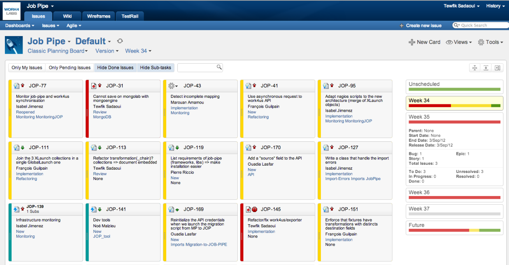
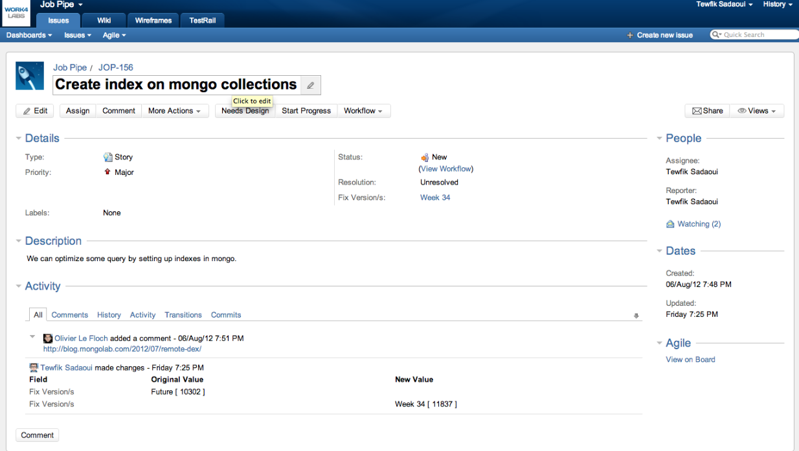
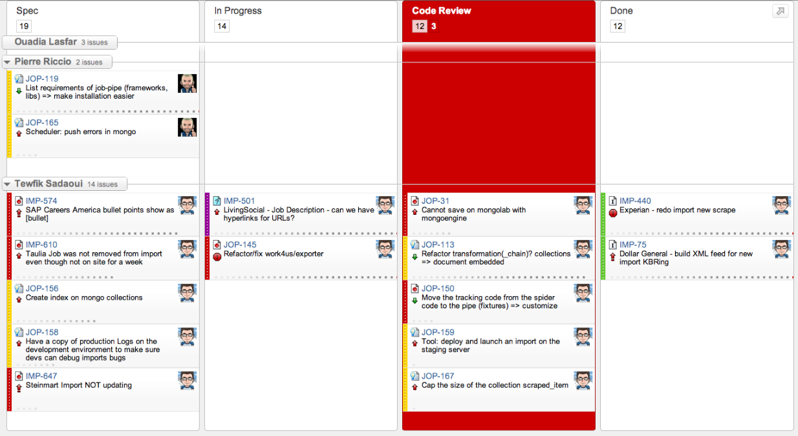
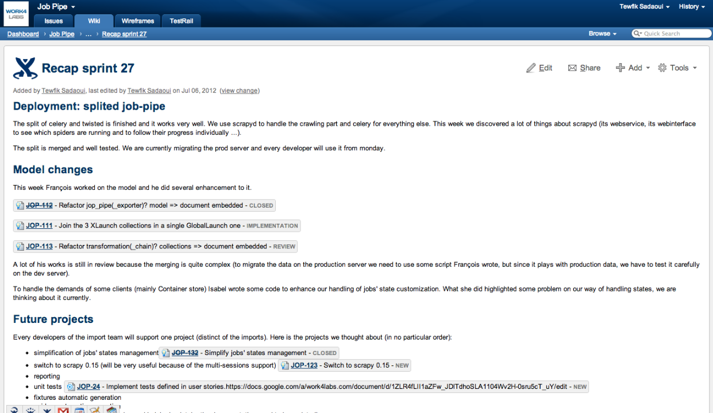
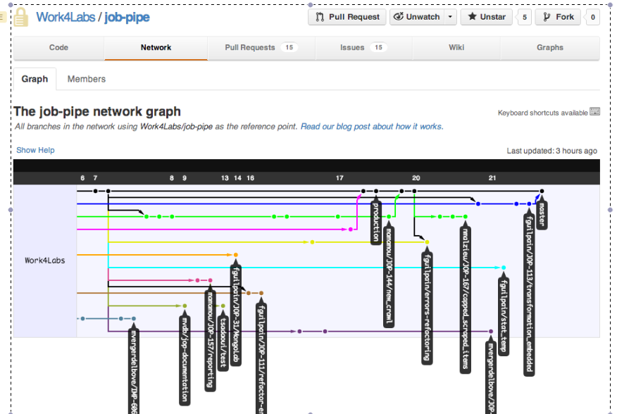
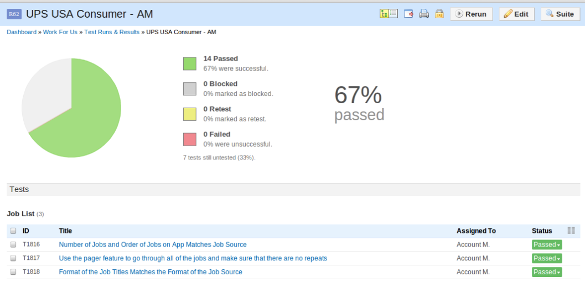

Vie de l'entreprise
===================

Une équipe internationale
-------------------------

Le siège social de Work4Labs est basé à San Francisco, en Californie. La grande majorité des équipes commerciales, celles gérant la relation client et la plupart de nos clients sont là bas également. Certains employés travaillent de New York, de Londres ou encore de Berlin (essentiellement des prospects commerciaux). Toutes ces raisons font que la dimension multiculturelle et internationale est très forte chez Work4Labs et cela ajoute à l'intérêt de travailler pour l'entreprise au quotidien.

L'équipe import dont je fais partie en particulier, est amenée à travailler avec les clients et services associés et donc les échanges internationnaux font parti de notre quotidien. Nous avons des liens particulièrement étroit avec le service de relation client, avec lequel nous communiquons par messagerie intantannée, et par mail en permanence, et assez régulièrement par Skype.

De temps en temps il y a des échanges. Des collaborateurs habitant à Paris vont passer quelques semaines à San Francisco, et ceux de San Francisco viennent en France. Cela permet d'associer des visages à des personnes avec lesquels nous travaillons au quotidien sans les avoir jamais vus. Cela apporte beaucoup à la dynamique de l'entreprise.

Déménagement
------------

Work4Labs et Multiposting partagent leurs bureaux à Paris. La croissance des deux entreprises est telle (en partie grâce aux levées de fond dont nous avons bénéficié), que les équipes ne cessent de s'agrandir, et la taille des bureaux doit croitre en fonction de celle de l'équipe.
Depuis que j'ai commencé mon stage, en septembre, j'ai déjà assisté à deux déménagements, avec la logistique que cela impose.

A chaque fois c'est l'occasion de faire le point sur la croissance de l'entreprise et de réaliser le chemin parcourru.

Au début de mon stage les bureaux étaient rue d'Aumale dans le 9e arrondissement. Les équipes étant devenues trop nombreuses pour les bureaux d'Aumale, Work4Labs et Multiposting ont dû se séparer, Multiposting restant rue d'Aumale pendant que Work4Labs allait occuper des bureaux à République. Nous sommes restés dans ces bureaux quelques mois, puis les bureaux étaient à nouveau devenus trop petits et les deux entreprises se sont rassemblées dans un immeuble rue Moncey (9e).

Nous occupons actuellement 3 étages de l'immeuble, et deux autres étages sont actuellement en travaux. Il est prévu de les occuper à partir de janvier. Selon les prévisions les équipes seront déjà devenues trop grandes pour nos seuls bureaux actuels. C'est une course incessante.

L'équipe
--------

**Olivier Le Floch** est le CTO de Work4Labs. Globalement c'est lui qui est responsable des projets techniques, de leur avancement et des équipes techniques.

**Nick Grosleau** est VP Technology, il s'occupe de toute la partie management/process des équipes techniques. Il est arrivé le dernier mois de mon stage. Au début Olivier s'occupait seul des aspects techniques et du management des équipes techniques, mais la croissance de l'entreprise a rendu cette charge trop importante.

**Léopold Boudard** était le responsable du développement de Job-pipe a mon arrivée. Il a depuis été amené à prendre la responsabilité d'un autre projet (Work4Ads). C'est lui qui m'a mis le pied à l'étrier sur tout ce qui concerne Job-pipe.

**Ouadia Lasfar** est le responsable de l'équipe import. Il travaille depuis longtemps chez Work4Labs (et Multiposting avant ça) et a une très bonne connaissance de la plupart des systèmes de l'entreprise, ce qui lui permet d'être de bon conseil quand nous devons nous interfacer avec d'autres systèmes (en particulier Work4Us).

**François Guilpain** est un autre stagiaire venant de l'UTC également (il est en TN09). Nous sommes arrivés quasiment en même temps et avons beaucoup travaillé ensemble.

**Pierre Riccio** et **Bilel Gasmi** sont tous les deux des membres de l'équipe import. Ils avaient déjà quelques mois d'ancienneté quand mon stage a commencé.

**Isabel Jimenez** et **Marouan Amamou** sont deux autres membres de l'équipe import, ils sont arrivés quelques mois après le début de mon stage.

L'équipe a déjà grandi depuis (deux nouvelles personnes arrivées en aout et quatre autres vont arriver en septembre), mais cela ne concerne plus mon stage.

Les outils
----------

Facebook
~~~~~~~~

Le coeur de l'activité de Work4Labs est le recrutement sur les réseaux sociaux et **Facebook** en particulier. Nous utilisons beaucoup les API Facebook dans nos applications, et nous l'utilisons également pour tester les applications que nous développons.

http://facebook.com

Jira
~~~~

L'outil principal qui organise la vie des équipes technique est **Jira**. Jira gère les tâches, les plannings, il sert de bug tracker, de base documentaire, il permet à chaque équipe de tenir un blog détaillant l'avancé du projet, il nous permet de rédiger des documents (rapports, spécifications) collaborativement ... C'est vraiment l'outil central de référence utilisé par toutes les équipes techniques.

Liste des tâches sur jira:

Exemple de tâche:

Vue représentat un sprint:

Exemple de documentation hébergée sur jira:

Github
~~~~~~

**Github** est la plate forme utilisée pour héberger nos dépots git (qui est un outil de gestion de version), de plus il nous sert de support pour les codes reviews (il offre des fonctionnalités pour commenter des parties du code et pour discuter autour d'aspects techniques).

Vue permettant de visualiser les relations entre tous les developpement en cours.

Testrails
~~~~~~~~~

**Testrails** est basiquement un outil de checklist qui nous sert de support dans la validation des tests de certains projet.

Asana
~~~~~

**Asana** est un outil de gestion de tâches. On peut considérer que c'est l'équivalent de Jira pour le personnel non-technique. Je l'ai utilisé essentiellement quand j'ai travaillé avec les ressources humaines (corrections des tests envoyés par les candidats stagiaires, planification des entretiens, discussion à propos des candidats ...).
